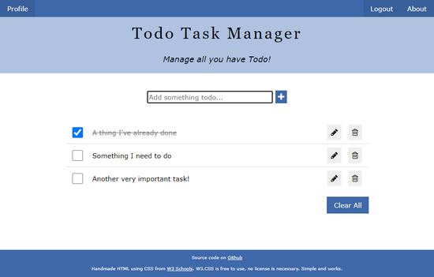

# JavaScript Todo Task Manager App

It seems everyone writes a Todo / Task Manager app when learning Web/HTML/CSS/JavaScript - this is a one of those. Done **three** ways.

The three versions are:  
1. A simple [DOM-Based](https://github.com/sansbacher/todo-task-manager/tree/master/DOM-Based) version
2. A version saves the state by being [LocalStorage-Based](https://github.com/sansbacher/todo-task-manager/tree/master/LocalStorage-Based)
3. And a Front-end for a REST [API-Based](https://github.com/sansbacher/todo-task-manager/tree/master/API-Based) implementation

All three are very similar in style and function, and fairly well commented so you can see the progression.

The style/look is fairly plain (I discovered that I'm much less interested in graphics/web design or learning much CSS so I just used a simple [CSS framework](https://www.w3schools.com/w3css/default.asp) - one that had a decent reference and quick "Try it" buttons). All are Vanilla JavaScript, no JS Frameworks. But I added features like Editing a Task, an Empty State prompt, and logging in/out or editing a Profile (for the API-Based version). And then added a second version with more features.

The HTML/CSS/JavaScript should work in any modern browser, like Chrome, Opera Chromium, Firefox, or Legacy Edge - even Chrome on Android or Safari on iOS. It can't be used with Internet Explorer, but then neither should you.

I hope these are useful for someone!
